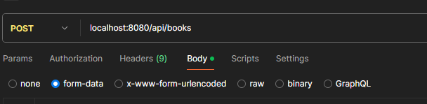

<!-- PROJECT LOGO -->
<br />
<div align="center">
  <a href="https://github.com/othneildrew/Best-README-Template">
    
  </a>

<h3 align="center">Book store</h3>
</div>


<details>
  <summary>Table of Contents</summary>
  <ol>
    <li>
      <a href="#about-the-project">About The Project</a>
      <ul>
        <li><a href="#built-with">Built With</a></li>
      </ul>
    </li>
    <li>
      <a href="#getting-started">Getting Started</a>
      <ul>
        <li><a href="#installation">Installation</a></li>
      </ul>
    </li>
    <li><a href="#usage">Usage</a></li>
  </ol>
</details>


<!-- ABOUT THE PROJECT -->
## About The Project


A project for publishing books with detailed information about each book, searching books by title, categories, adding books you like to your favorites/basket, adding a review of a book, viewing all reviews, and also posting reactions to reviews to rate other users of this book

Here's why:
* Helps you find the right book based on preferences and reviews from other users
* the application can be used on any platform
* easy to use


### Built With


* [![Spring][Spring]][Spring-url]
* [![Hibernate][Hibernate]][Hibernate-url]
* [![Liquibase][Liquibase]][Liquibase-url]
* [![Postgresql][Postgresql]][Postgresql-url]
* [![Thymleaf][Thymeleaf]][Thymleaf-url]
* [![Junit5][Junit5]][Junit5-url]
* [![Swagger][Swagger]][Swagger-url]
* [![JQuery][JQuery.com]][JQuery-url]
* [![Swiper][Swiper]][Swiper-url]


<!-- GETTING STARTED -->
## Getting Started

This is an example of how you may give instructions on setting up your project locally.
To get a local copy up and running follow these simple example steps.

### Installation

1. Install Docker
2. Clone the repo
   ```sh
   git clone https://github.com/R0n316/book-store-v2.git
   ```
3. execute command
   ```sh
   docker-compose up
   ```


<!-- USAGE EXAMPLES -->
## Usage

To ___add books___ to the database, you can send a request to the url:
```http request
/api/books
```
with data in the multipart/form-data format:




<!-- MARKDOWN LINKS & IMAGES -->
<!-- https://www.markdownguide.org/basic-syntax/#reference-style-links -->

[Spring]: https://camo.githubusercontent.com/621ad45e5af2fa8ce30932b8e9a5c6561ec0b3180845ec409a932da8bb5e09f6/68747470733a2f2f696d672e736869656c64732e696f2f7374617469632f76313f7374796c653d666f722d7468652d6261646765266d6573736167653d537072696e6726636f6c6f723d364442333346266c6f676f3d537072696e67266c6f676f436f6c6f723d464646464646266c6162656c3d
[Spring-url]: https://spring.io/projects/spring-framework
[Hibernate]: https://camo.githubusercontent.com/06b0c4daa865c184fbaccc029d1cd443dac10e534d6715dd1b51c2463a30210b/68747470733a2f2f696d672e736869656c64732e696f2f7374617469632f76313f7374796c653d666f722d7468652d6261646765266d6573736167653d48696265726e61746526636f6c6f723d353936363643266c6f676f3d48696265726e617465266c6f676f436f6c6f723d464646464646266c6162656c3d
[Hibernate-url]: https://hibernate.org/
[Liquibase]: https://camo.githubusercontent.com/69f28a75c3e7afd63269bd7e775cfea378001cd4aaa612844ad2234d6c17a5a6/68747470733a2f2f696d672e736869656c64732e696f2f7374617469632f76313f7374796c653d666f722d7468652d6261646765266d6573736167653d4c697175696261736526636f6c6f723d323936324646266c6f676f3d4c6971756962617365266c6f676f436f6c6f723d464646464646266c6162656c3d
[Liquibase-url]: https://www.liquibase.com/
[Thymeleaf]: https://camo.githubusercontent.com/2e880f0e3197b6465223a6a28d93d9b1bce9cc6e00060ae102d1526da8e720e2/68747470733a2f2f696d672e736869656c64732e696f2f7374617469632f76313f7374796c653d666f722d7468652d6261646765266d6573736167653d5468796d656c65616626636f6c6f723d303035463046266c6f676f3d5468796d656c656166266c6f676f436f6c6f723d464646464646266c6162656c3d
[Thymleaf-url]: https://www.thymeleaf.org/
[Junit5]: https://camo.githubusercontent.com/0ec0af3112b73b519c79846f78d224a64c09512fb5018b96453dc59f5fa0a463/68747470733a2f2f696d672e736869656c64732e696f2f7374617469632f76313f7374796c653d666f722d7468652d6261646765266d6573736167653d4a556e69743526636f6c6f723d323541313632266c6f676f3d4a556e697435266c6f676f436f6c6f723d464646464646266c6162656c3d
[Junit5-url]: https://junit.org/junit5/
[Postgresql]: https://img.shields.io/static/v1?style=for-the-badge&message=PostgreSQL&color=4169E1&logo=PostgreSQL&logoColor=FFFFFF&label=
[Postgresql-url]: https://www.postgresql.org/
[Swagger]: https://img.shields.io/static/v1?style=for-the-badge&message=Swagger&color=222222&logo=Swagger&logoColor=85EA2D&label=
[Swagger-url]: https://swagger.io/
[JQuery.com]: https://img.shields.io/badge/jQuery-0769AD?style=for-the-badge&logo=jquery&logoColor=white
[JQuery-url]: https://jquery.com
[Swiper]: https://img.shields.io/static/v1?style=for-the-badge&message=Swiper&color=6332F6&logo=Swiper&logoColor=FFFFFF&label=
[Swiper-url]: https://swiperjs.com/

---
### 09.08.2024